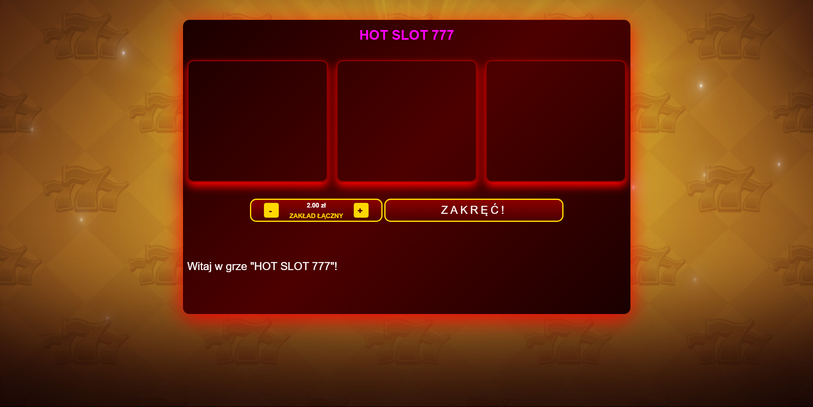

# 🎰 Slot Machine



A simple slot machine game built with pure JavaScript using basic OOP concepts.  
Includes a browser version and a desktop version built with Electron.

## 🕹️ Features
- Random symbols with images
- Basic win/lose logic
- Sound effects for better user experience
- Clean layout styled with HTML and CSS
- 🖥️ Desktop version powered by Electron

## 🚀 How to Run

### 🔗 Browser Version
1. Clone or download this repository
2. Open `index.html` in any modern web browser — no server required

### 💻 Electron Version
1. Make sure you have [Node.js](https://nodejs.org/) installed
2. Navigate to the `electron-version/` folder
3. Run:

```bash
npm install
npm start
